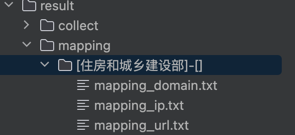
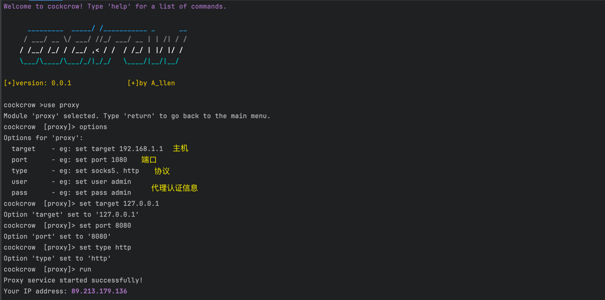

# 工具介绍：


> cockcrow为一款综合性测试工具，内置多个功能模块。包括端口扫描scan模块、域名枚举subdomain模块、目录扫描directory模块、资产测绘mapping模块、指纹识别finger模块、辅助测试auxillary模块(没想好写啥)、漏洞利用exploit模块、服务爆破explosion模块、孙子公司信息收集collect模块、全局代理proxy模块、批量发送钓鱼邮件fishing模块。

# 功能模块:

## scan模块

>1、运行程序后输入 [<mark>use scan</mark> 进入该模块；
>
>2、输入[<mark>options</mark>]查看配置选项；

>3、[<mark>set command</mark>]设置对应的参数；
>
>4、[<mark>run</mark>]运行该模块。
>
>

## subdomain模块

>1、运行程序后输入 [<mark>use subdomain</mark>] 进入该模块；
>
>2、输入[<mark>options</mark>]查看配置选项；

>3、[<mark>set command</mark>]设置对应的参数；
>
>4、[<mark>run</mark>]运行该模块。
>
>

## directory模块

>1、运行程序后输入 [<mark>use directory</mark>] 进入该模块；
>
>2、输入[<mark>options</mark>]查看配置选项；

>3、[<mark>set command</mark>]设置对应的参数；
>
>4、[<mark>run</mark>]运行该模块。
>
>
>
>

## mapping模块

>填写软件所在的同级目录下的config/config.yaml的相关配置，填写你的api。
>
>
>
>1、运行程序后输入 [<mark>use mapping</mark>] 进入该模块；
>
>2、输入[<mark>options</mark>]查看配置选项；

>3、[<mark>set command</mark>]设置对应的参数；
>
>4、[<mark>run</mark>]运行该模块。
>
>
>
>输出结果会在result/mapping/[住房和城乡建设部]-[]下生成三个文件，自行查看去重后的结果。并可将其指定scan、subdomain、directroy模块进行其他任务。
>
>

## finger模块

>1、运行程序后输入 [<mark>use finger</mark>] 进入该模块；
>
>2、输入[<mark>options</mark>]查看配置选项；

>3、[<mark>set command</mark>]设置对应的参数；
>
>4、[<mark>run</mark>]运行该模块。
>
>

## ## ~~auxillary模块(没想好要写什么)~~

>~~1、运行程序后输入 [<mark>use auxillary</mark>] 进入该模块；~~
>
>~~2、输入[<mark>options</mark>]查看配置选项；~~

>~~3、[<mark>set command</mark>]设置对应的参数；~~
>
>~~4、[<mark>run</mark>]运行该模块。~~
>
>

## exploit模块

>1、运行程序后输入 [<mark>use exploit</mark>] 进入该模块；
>
>2、输入[<mark>options</mark>]查看配置选项；

>3、[<mark>set command</mark>]设置对应的参数；
>
>4、[<mark>run</mark>]运行该模块。
>
>
>
>

## explosion模块

>1、运行程序后输入 [<mark>use explosion</mark>] 进入该模块；
>
>2、输入[<mark>options</mark>]查看配置选项；

>3、[<mark>set command</mark>]设置对应的参数；
>
>4、[<mark>run</mark>]运行该模块。
>
>

## collect模块

>填写软件所在的同级目录下的config/config.yaml的相关配置，填写你的爱企查的cookie信息。
>
>
>
>1、运行程序后输入 [<mark>use collect</mark>] 进入该模块；
>
>2、输入[<mark>options</mark>]查看配置选项；

>3、[<mark>set command</mark>]设置对应的参数；
>
>4、[<mark>run</mark>]运行该模块。
>
>
>
>输出结果会在result/collect下生成collect_住房和城乡建设部.txt，自行查看结果
>
>

## proxy模块

>1、运行程序后输入 [<mark>use proxy</mark>] 进入该模块；
>
>2、输入[<mark>options</mark>]查看配置选项；

>3、[<mark>set command</mark>]设置对应的参数；
>
>4、[<mark>run</mark>]运行该模块。
>
>
>
>
>
>
>
>配置好代理池后，可[<mark>return</mark>]返回主菜单 使其他模块流量走代理池。
>
>

## fishing模块

>首先要配置config/fishing/email_config.txt的邮件内容
>
>格式如下：
>
>```
>EmailAccount:<xxxxxx@qq.com>
>EmailPassword:<xxxxxx>
>SMTPServer:<smtp.qq.com>
>SMTPPorts:<25/465/587>
>FromEmail:<xxxxxx@qq.com>
>Subject:<这是测试>
>Body:<点击如下二维码 http://192.168.1.1>
>```
>
>替换<>中的内容即可
>
>如果Body中有“二维码”字样，则提取邮件正文中的url地址并转为二维码图片，最终将二维码图片嵌入到邮件正文一同发送。
>
>如果发现对方邮箱域的mx记录 存在spf，则尝试进行邮件伪造。
>
>1、运行程序后输入 [<mark>use fishing</mark>] 进入该模块；
>
>2、输入[<mark>options</mark>]查看配置选项；

>3、[<mark>set command</mark>]设置对应的参数；
>
>4、[<mark>run</mark>]运行该模块。
>
>
>
>
>
>``````
>1、程序会查看txt记录和mx记录
>allen@MacBookPro ~ % nslookup -q=txt qq.com     
>Server:		8.8.8.8
>Address:	8.8.8.8#53
>
>Non-authoritative answer:
>qq.com	text = "v=spf1 include:spf.mail.qq.com -all"
>
>Authoritative answers can be found from:
>allen@MacBookPro ~ % nslookup -q=mx qq.com 
>Server:		8.8.8.8
>Address:	8.8.8.8#53
>
>Non-authoritative answer:
>qq.com	mail exchanger = 30 mx1.qq.com.
>qq.com	mail exchanger = 20 mx2.qq.com.
>qq.com	mail exchanger = 10 mx3.qq.com.
>
>Authoritative answers can be found from:
>
>2、配置文件中如果未指定FormEmail字段，则会尝试设置随机发件人邮箱
>3、如果尝试几次后仍未成功发送邮件时，则根据EmailAccount字段来设置FormEmail
>
>根据RFC5322协议，邮件标头中需要包含'From'信息。
>根据RFC2047, RFC822协议，邮件标头中的'From'形式为：
>邮箱地址形式：prefix@domain, 如 'abc@qq.com'。
>4、在使用前，需要测试邮箱地址、密码是否能成功登录
>命令如下：
>telnet qq.com 25
>HELO test
>AUTH LOGIN
><输入base64编码后的发件人邮箱地址>
><输入base64编码后的邮箱密码或授权码>
>提示successfully证明可用
>``````
>
>

# 程序扩展:

``````
1、collect模块，只实现了爬爱企查平台，用户可参考源码编写其他平台的代码逻辑。如小蓝本、企查查、站长之家等；
2、mapping模块，用户可自行丰富其他资产测绘平台，自己改写测绘语句等。目前只实现了fofa、hunter、quake平台
测绘语句在源代码中146-162行，如果有更好的测绘语句可自行更改。测绘数据只给了100条，可根据自身需求修改；
3、exploit模块，用户可自行参考md编写格式来丰富自己的漏洞检测模版；
4、finger模块，用户可自行参考dict/finger下的yaml文件来自行扩充。
``````

# 运行
``````
确保如下文件夹、文件与可执行程序在同一路径下即可
1、dict文件夹及子文件夹中的文件
2、config文件夹及子文件夹中的文件
3、result文件夹及子文件夹中的文件
``````

# 致谢

感谢<span style="background-color: blue;">吴茂铨</span>大佬
https://mp.weixin.qq.com/s/_92uFDPsy284oQvv21YMIw，

 POC、EXP模版文件均引用DudeSuite

